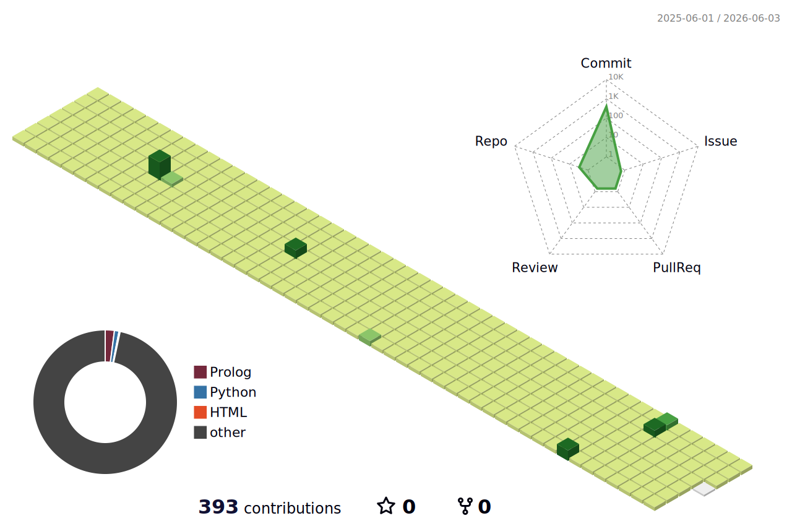

        

<h2 style="border-bottom: 1px solid #d8dee4; color: #282d33;">
🙌Self-Introduction</h2>

 
        I'm Yunji.
 
        

<h4 style="font-weight: 700; font-size: 15px; text-align: center; color: #282d33;"> 

</h4> 

<h2 style="border-bottom: 1px solid #d8dee4; color: #282d33;">
🧑‍💻Contact me </h2> 

 

            
<h2 style="border-bottom: 1px solid #d8dee4; color: #282d33;">
🏅Stats </h2> 
 
 

  
