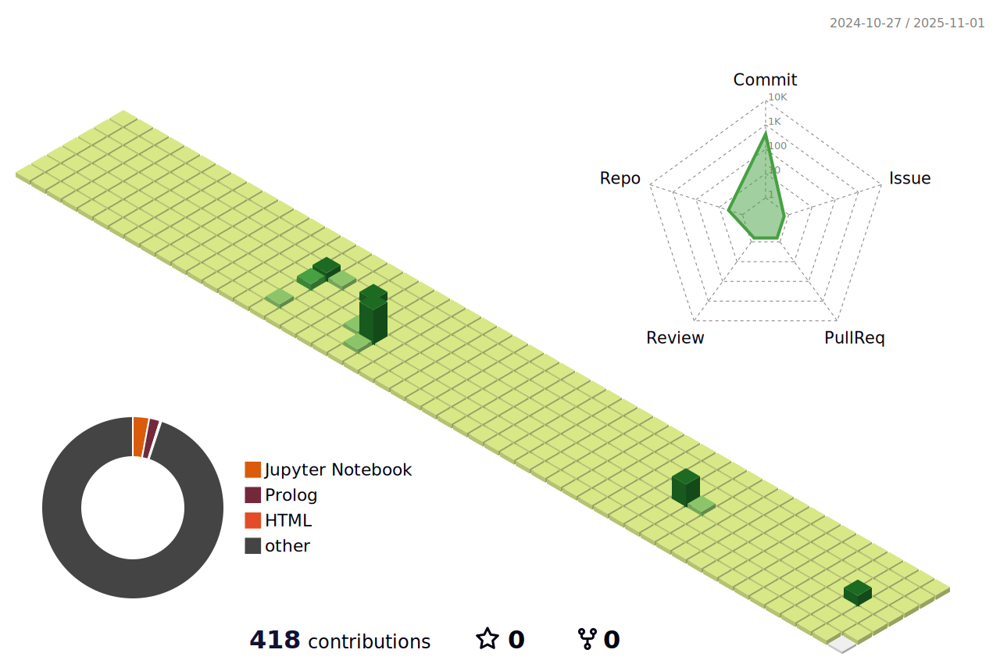

### Hi there 👋

<!--
**yunjijeong** is a ✨ _special_ ✨ repository because its `README.md` (this file) appears on your GitHub profile.

Here are some ideas to get you started:

- 🔭 I’m currently working on ...
- 🌱 I’m currently learning ...
- 👯 I’m looking to collaborate on ...
- 🤔 I’m looking for help with ...
- 💬 Ask me about ...
- 📫 How to reach me: ...
- 😄 Pronouns: ...
- ⚡ Fun fact: ...
-->

<!-- 이름 로고 -->

    

<!-- 링크 -->

<!-- 프로그래밍 언어 -->

    <h2 style="border-bottom: 1px solid #d8dee4; color: #282d33;"> 🖥️ Available Languages </h2>   
    
 
          
          
          
          
           

    

<!-- 툴 -->

    <h2 style="border-bottom: 1px solid #d8dee4; color: #282d33;"> 🛠️ Available Tools </h2>   
    
 
          
          
          
          
           
          
          
          
          

    

    
<!-- 프레임워크 -->

    <h2 style="border-bottom: 1px solid #d8dee4; color: #282d33;"> 🙌 Tech Stacks </h2>   
    
 
          
          
          
          
           
          

    

  
 
<!-- 깃헙 정보 -->

    

<!-- 3D 잔디 -->

포트폴리오 --> https://yunjij00.github.io/yunjijeong/
