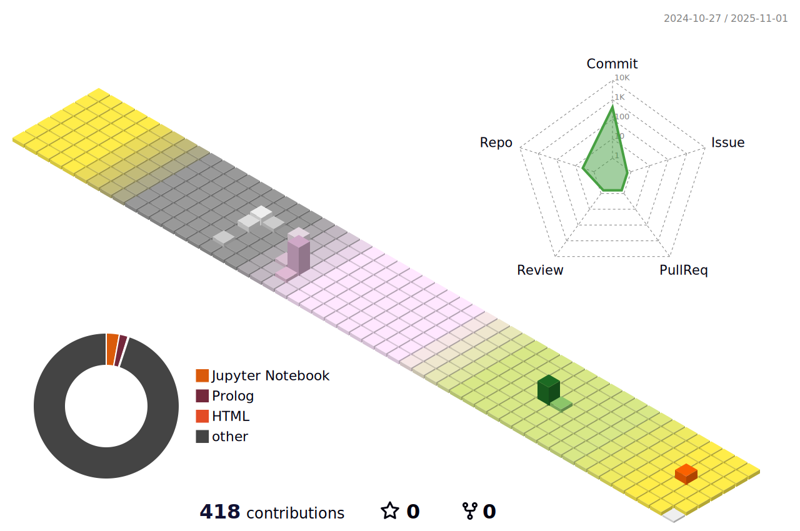

<!-- 이름 로고 -->

    

<!-- 자기소개 -->

 
    <h2 style="border-bottom: 1px solid #d8dee4; color: #282d33;"> I'm Yunji who lives happily every day. </h2>  
    
 I am a student who dreams of becoming an AIoT developer. I am getting ready for the future by living happily every day. 
 
    

    
<!-- 프로그래밍 언어 -->

    <h2 style="border-bottom: 1px solid #d8dee4; color: #282d33;"> 🖥️ Skills </h2>   
    
 
          
          
          
          
           

    

<!-- 툴 -->

    <h2 style="border-bottom: 1px solid #d8dee4; color: #282d33;"> 🛠️ Available Tools </h2>   
    
 
          
          
          
          
           
          
          
          
          

    

    
<!-- 프레임워크 -->

    <h2 style="border-bottom: 1px solid #d8dee4; color: #282d33;"> 🙌 Tech Stacks </h2>   
    
 
          
          
          
          
           
          

    

<!-- contact me -->

    <h2 style="border-bottom: 1px solid #d8dee4; color: #282d33;"> 🧑‍💻 Contact me </h2>   
    
 
         
         
         
         
          
    
    
 
       
 
    

    
<!-- 깃헙 정보 -->

 
    <h2 style="border-bottom: 1px solid #d8dee4; color: #282d33;"> 🏅 Stats </h2> 
    
 
          
 
    

포트폴리오 --> https://yunjij00.github.io/yunjijeong/
